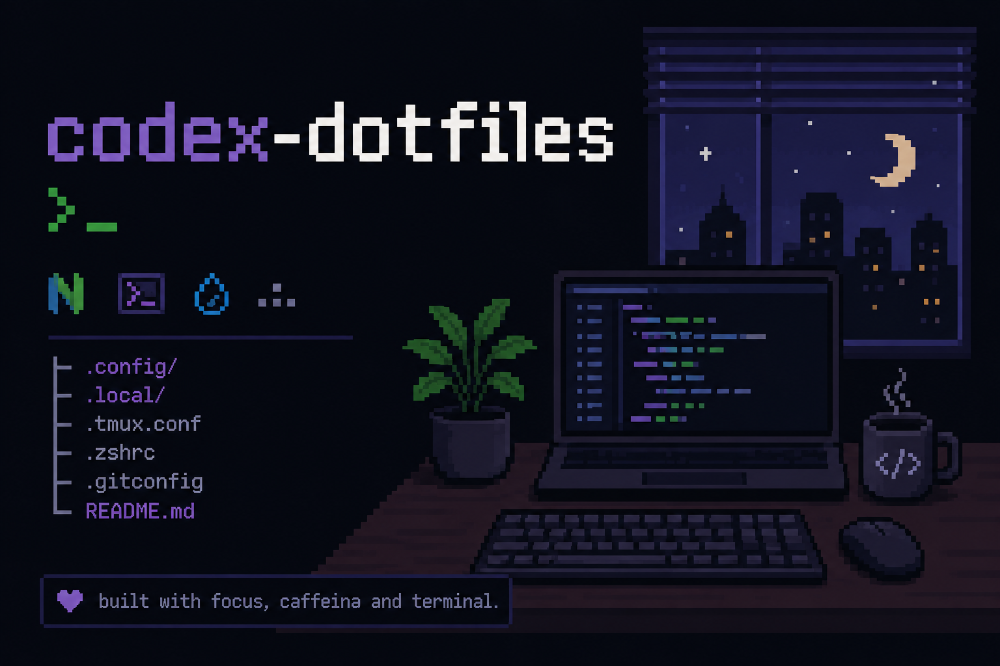

# codex-dotfiles

> Install everything by copying [INSTALL.md](./INSTALL.md) into Codex and following the prompt.

Personal Codex defaults for orchestrated software development. The primary agent investigates, plans, reviews, and approves. Two cheaper custom agents handle implementation and pull-request publication.

## Workflow

1. The primary agent investigates the repository and approves a concrete plan.
2. `Luna Max Implementer` implements and validates the plan.
3. The primary agent reviews the actual diff and sends substantive fixes back to the same implementer.
4. The primary agent performs final acceptance.
5. `Luna PR Writer` creates the branch, commit, push, and pull request.

Small mechanical changes can stay in the primary agent when delegation would cost more than the work.

## Contents

```text
AGENTS.md
agents/
  luna-max-implementer.toml
  luna-pr-writer.toml
skills/
  monthly-summary/
    SKILL.md
  orchestrated-development/
    SKILL.md
  share-prs-on-slack/
    SKILL.md
INSTALL.md
```

- [`AGENTS.md`](./AGENTS.md) contains concise global defaults and routes non-trivial development to the workflow skill.
- [`monthly-summary`](./skills/monthly-summary/SKILL.md) creates a per-day report of the current user's Git activity for the current calendar month by inspecting commit diffs.
- [`orchestrated-development`](./skills/orchestrated-development/SKILL.md) defines investigation, implementation, review, validation, and publication.
- [`share-prs-on-slack`](./skills/share-prs-on-slack/SKILL.md) drafts and publishes PR announcements through the Slack UI after destination and message approval.
- [`Luna Max Implementer`](./agents/luna-max-implementer.toml) is the only write-heavy implementation worker.
- [`Luna PR Writer`](./agents/luna-pr-writer.toml) handles approved Git and pull-request operations.

The primary model is selected in Codex or its local configuration. The custom agents explicitly use `gpt-5.6-luna` with different reasoning efforts.

## Workflow dependencies

- [Ponytail](https://github.com/DietrichGebert/ponytail) keeps implementations minimal.
- [Caveman](https://github.com/JuliusBrussee/caveman) provides concise communication and commit-message skills.

The installation prompt detects these dependencies and installs only what is missing.

## Installation model

The installer copies only the files owned by this repository:

```text
~/.codex/AGENTS.md
~/.codex/agents/luna-max-implementer.toml
~/.codex/agents/luna-pr-writer.toml
~/.agents/skills/monthly-summary
~/.agents/skills/orchestrated-development
~/.agents/skills/share-prs-on-slack
```

It creates regular files and directories, not symbolic links, and does not replace the whole `~/.codex` directory. Authentication, history, logs, local configuration, other agents, and other skills remain local.

The installed copies do not update automatically. After changing this repository, run the installation prompt again to refresh them.

See the official OpenAI documentation for [AGENTS.md](https://learn.chatgpt.com/docs/agent-configuration/agents-md), [skills](https://learn.chatgpt.com/docs/build-skills), and [subagents](https://learn.chatgpt.com/docs/agent-configuration/subagents).
